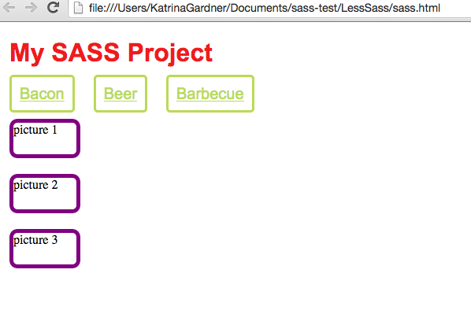
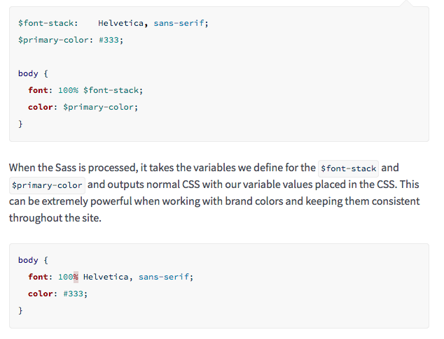
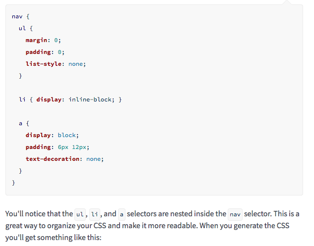
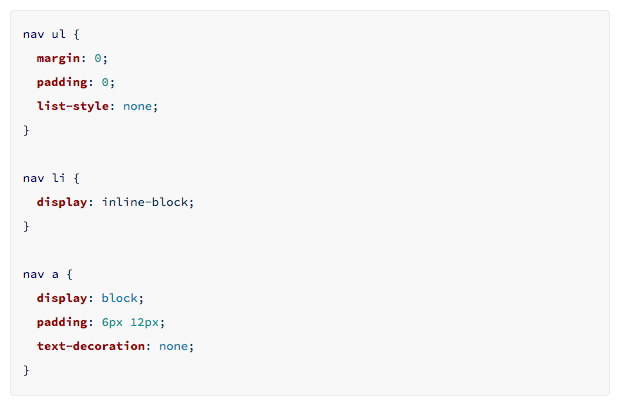
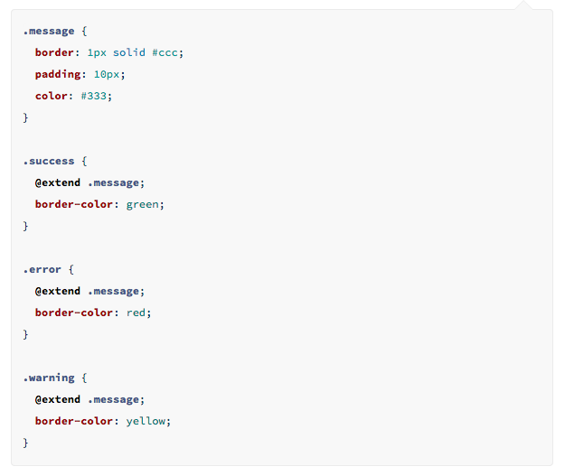
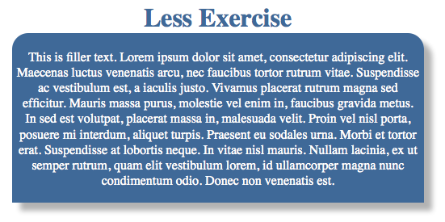

## LESS/SASS TUTORIAL

#### This tutorial focuses on teaching the two most common CSS processors - Less and SASS. Less is an npm which uses Javascripts while SASS is Ruby based. Both allow for us to being writting more dynamic stylsheets for better code. Which should you use on your next project? Let’s starts learning and figure that out together!

####The important thing to remember is to keep calm. This all seems like a lot of super confusing information. In fact, many programmers wanted to stay away from CSS processors because they seem so complicated. But you already know basic HTML, CSS, JavaScript, and Ruby. You just have to learn how to write code in a little bit of a new way. We promise, this will change your life forever… in a good way.

### What is a CSS Processor?
Basically a supercharged CSS file that contains variables, functions, "mixins", and other features. After development, these special files get compiled into regular CSS files that all web browsers understand.
PLUS - this will make your CSS DRY! How? Because for the first time we are going to be able to use things like variables and functions. How cool is that?
Think of it as a new, more functional, way of writting a language that you are already fluent in.

### What is Compiling?
Something you need to understand is that while using Less and SASS you will not be creating CSS files - those will be compiled based off your code. 
With SASS this will happen automatically, through command line, every time you save (more and that later). With Less we will be using an open source application - Less.app (there are a few different apps available).
We will be writing .scss and .less files. Each has a lot of different tools and functions to use that will then be compiled into regular CSS. Our files must be compiled otherwise the browser will not understant them. But, we are not writing that CSS out. This is a way to help us work better and be more organized.

### The Basics for Both -
Here a couple terms and tools you need to understand before we dive in.

1. Variables -
     Variables are pre-assigned values anywhere that can be used anywhere in your stylesheet. Just like declaring a variable in JavaScript or Ruby! These really come in handy for saving color values.

2. Loops -
     Less features a “guarded mixin” capability, which are mixins (functions) that are implemented when a certain condition is met.
     Sass loops are far superior, with built-in while and for loops, and if-then-else statements.
     We are not going to go into much detail about loops. But feel free to check out more on [Les and SASS loops](http://www.zingdesign.com/less-vs-sass-its-time-to-switch-to-sass/)

3. Nesting -
     If we need to reference multiple elements with the same parent in our CSS, it can be tedious to keep writing the parent over and over. In both SASS and Less we have certain nesting powers which keeps us from writing the same properties a million times.

4. Mixins - 
     Mixins are functions. Yup, you heard it right - functions. Mixins allow us to assign a bunch of properties to one selector and then be called throughout our stylesheet. Think about programming. We define a function, and call it whenever we want that function to be used. Same thing here!

5. Inheritance -
     Inheritance only exists in SASS, but it is still an important concept to understand before we get deep. Okay let’s say we want to select multiple selectors and add a bunch of the same properties to them.
     We can do that in CSS. However, what if you want to then add on some properties to just one or even all the selectors? You have to have additional selectors and it all gets very messy. In SASS, you define everything for the first selectors.
     Then use @extend .selector on additional selectors. Meaning, you are basically calling all those properties and adding on. This keeps things so much cleaner.

### Less -

 There are many different ways to access Less but we are going to install it on our machines via npm.

####Installation and Set-Up
1. Open up command line and run:

     $ npm install -g less

2. Less, unlike SASS, does not have a built in compiler. We like [less.app](http://download.cnet.com/Less-app/3000-10248_4-76116255.html) which is an open source GUI compiler application.
3. You should have a folder created in which you can store HTML and styling files.
4. In order to see this in action, we are going to need some basic HTML and Less. I have provided that for you in this repo. Take a look at "less.html" and "stylesLess.less".
   Don’t worry if you don’t understand the information in the files - we are going to go over it line by line after we finish set-up.
5. Open up less.app and import your "stylesLess.less" file. The great thing is that you only have to do this once. Import the file, click on the compile tab and save the less file. This should automatically create a stylesLess.css file in your folder. Now, every time you hit save - less.app will automatically compile the CSS.
6. We like less.app because it is super simple to use + has an awesome built in error feature. When an error occurs and CSS couldn’t be compiled, Less.app will alert you with a log of where the error occurred.
7. We linked the CSS for you already. But, it is important to note that in the HTML file you will link to CSS not a Less file.
8. Pop your HTML into a browser to check it out.
9. If you are using sublime, you will notice that .less or .scss files do not have any colors. Which is annoying, right? Check out this [GitHub repo](https://github.com/danro/LESS-sublime)!

 Now we have a simple, working, and styled website that we hardly understand. Correct? Let’s go through it piece by piece!

####Examples and Explanation
 
#####Variables: 

Once again, think about programming. What’s a variable? In Less, they work the same exact way. We use the “@” symbol in front of a name and then define it. We recommend using names that relate to the definition. For example, when using colors you probably want to either use a something that describes the color or relates to where the color is being used. Once defined, these variables can be used anywhere. We will see them in action soon.

#####Mixin:

A mixin is basically a function that can be called in any selector. Under our variables we have a .txt which is a mixin (not a class). Inside we set up a whole bunch of styling that is going to be applied any time there are paragraphs of text. Instead of copying all these lines each time, we simply need to call it in our paragraphs, you’ll see that happen in just a bit. 

Notice something a little strange? why is font set to @font? Why is background-color set to @mainColor? Yup, you guest it  - that’s our variables in action!

#####Nesting:

Nesting is a great feature to help keep thing organized. Here, we have a div with the class “post”. Inside that div there is a paragraph, link, and image. Instead of keeping it all separate and writing all the sizes over and over again. We can nest the added information in side the .post selector. Awesome! Let’s go step by step.
1. We have given our entire div some simple styling rules to keep things nice and neat.
2. Check out what is happening in our paragraph. If you had to guess what .txt(); is doing what would you say? If you guessed calling the mixin .txt, you are correct! Doesn’t that look similar to calling a function in JavaScript?
3. We have some basic styling set up for a link.

## SASS- 

## Preprocessing-

CSS on its own can be fun, but stylesheets are getting larger, more complex, and harder to maintain. This is where a preprocessor can help. Sass lets you use features that don't exist in CSS yet like variables, nesting, mixins, inheritance and other nifty goodies that make writing CSS fun again.
Once you start tinkering with SASS, it will take your preprocessed SASS file and save it out as a normal CSS file that you can use in your web site.

*Step 1: First you will need to install SASS in your laptop. Enter the following line into your command prompt…

  Note: If you’re on Mac, you may have to include sudo at the start if you are not the root         user. 
  You won’t need to write this in Windows.

    $ [sudo] gem install sass

  If you do need to use sudo, it’ll just mean that you’ll have to type in your password before the command can run.
  The terminal should do some exciting stuff and eventually you’ll see a message likeblah blah blah… 1 gem 
  installed. Woohoo! Sass is good to go… 

*Step 2: Once you finished install SASS. Navigate to your Documents folder on the command line using the cd command. 

   On Mac:

    $ cd Document

   On Windows:

    $ cd Users/<your-user-name>/Documents

*Step 3: Create a folder…..You could do this the the old-fashioned way, but why not use the  
           command-line skillzzzz?

    Documents$ mkdir sass-test

    
*Step 4: Then we’re going to create out Sass and CSS file with the touch command on Mac
          or the echo command on Windows. 

    In Documents$ cd sass-test

    On Mac:

    sass-test$ touch test.scss test.css

    On Windows:

    sass-test$ echo.>test.scss
    sass-test$ echo.>test.css

    
*Step 5: Start “WATCHING” your Sass file

    sass-test$ sass --watch test.scss:test.css
    
  The Sass tool has a method called --watch , here we’re telling it to watch out Sass file and compile it to our      CSS on the fly. 
           
           
           
*Step 6: Write some Sass! Open up the test.scss file. Add the following code:

   

   This is Sassy CSS (hence the .scss), one of the two variations of SASS. It’s similar structure and syntax to CSS     makes it an easy place to start. To ease the learning curve, it’s also very similar syntax to Less.

   Save this file, and you should see your command prompt churning away. It’ll come up with a message like…

     >>>Change detected to: C:/Users/Username/Documents/sass-test/test.scss
          or
     >>> Change detected to: test.scss

…which means everything’s working as it should be!  It’ll keep automatically watching for any changes you make,      every time you save the file.

   Now, if you look at your test.css, you’ll see it’s generated:

   

   Great success!

*Step 7: Hook it up to the HTML… if you haven’t already! For anyone who’s been hanging on, waiting for the surprise          and excitement of seeing their Compass styles in action, get ready to have your mind blown!

   You need to create an index.html in the same sass-test directory, this will be where we hook in our newly 
   generated CSS.

   First of all, I’ll stop watching my project with Ctrl+C, then I’ll create the HTML file with the touch/echo 
   command used earlier.

   On Mac:

    $ touch index.html

   On Windows:

    $ echo.> index.html

    Let’s open up the index.html in our text editor of choice and add some basic markup.

   

*Step 8: Now open it up in the browser and behold the wondrous power of–

   

If you follow the code from our GitHub and open it up the browser. 
You will see below:

   

## Variables
Think of variables as a way to store information that you want to reuse throughout your stylesheet. You can store things like colors, font stacks, or any CSS value you think you'll want to reuse. Sass uses the $ symbol to make something a variable. Here's an example:

   

## Nesting

When writing HTML you've probably noticed that it has a clear nested and visual hierarchy. CSS, on the other hand, doesn't.
SASS will let you nest your CSS selectors in a way that follows the same visual hierarchy of your HTML. Be aware that overly nested rules will result in over-qualified CSS that could prove hard to maintain and is generally considered bad practice.
With that in mind, here's an example of some typical styles for a site's navigation:

   
   
   

## Mixins
Some things in CSS are a bit tedious to write, especially with CSS3 and the many vendor prefixes that exist. A mixin lets you make groups of CSS declarations that you want to reuse throughout your site. You can even pass in values to make your mixin more flexible. A good use of a mixin is for vendor prefixes. Here's an example for # border-radius.

   

## Extend/Inheritance
This is one of the most useful features of SASS. Using @extend lets you share a set of CSS properties from one selector to another. It helps keep your Sass very DRY. In our example we're going to create a simple series of messaging for errors, warnings and successes.

   
   
   

Now that you are a Less/Sass expert, let’s do an exercise! 

####Excersise

You can use either Less or SASS on this exercise. Please style a div that contains a paragraph of text. The div should have a border-radius and a box-shadow of any size and color. Feel free to use [filler text](http://www.lipsum.com/) for the paragraph.

You will need to have a basic HTML and .less (or .scss) file. Feel free to give your page extra styling! 

The final outcome should be something like this: 

   

The solutions are posted as "lessTest.HTML" and "lessTest.less" but you shouldn't take a look at those without trying! (There is no solutions for Sass....so you can't peak!)

