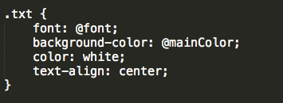
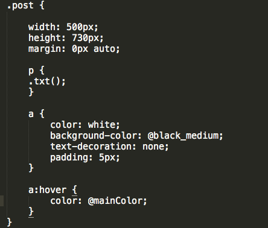
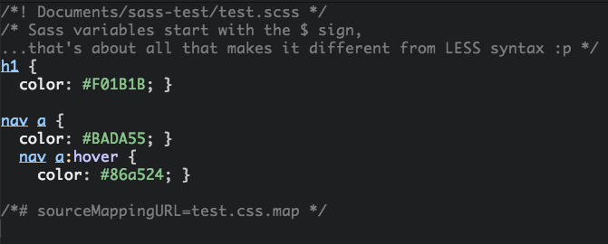

## LESS/SASS TOTURIAL

### This tutorial focuses on teaching the two most common CSS processors - Less and SASS. Less is an npm which obviously uses Javascripts and SASS is based off Ruby. Both allow you to make use of a whole bunch of new functions and extensions. Which should you use on your next project? Let’s starts learning and figure that out together!

### The important thing to remember is to keep calm. This all seems like a lot of super confusing information. In fact, many programmers wanted to stay away from CSS processors because they seem so complicated. But you know CSS, JavaScript, and Ruby. You just have to learn how to write code in a little bit of a new way. We promise, this will change your life forever… in a good way.

### What is a CSS Processor?
Basically a supercharged CSS file that contains variables, functions, "mixins", and other features. After development, these special files get compiled into regular CSS files that all web browsers could understand.
PLUS - this will make your CSS DRY. We are finally able to define properties ect. and keep reusing them. How cool is that?

### What is Compiling?
Something you need to understand from the beginning is that both Less and SASS will have a bunch of different files that need to be compiled into basic CSS.
With SASS this will happen automatically through command line every time you save (more and that later). With Less you can download an open source app - Less.app (there are a few different apps available).
The thing to realize is that you are not actually writing any CSS. We will be writing .SCSS and .LESS files. Each has a lot of different tools and functions you will be using that will then be compiled into regular CSS.
It needs to be compiled in order to be rendered online. So your CSS will eventually look the same as you are used to. But, we are not writing that CSS out. This is a way to help you work better and be more organized.

### Basic for Both -
Here a  couple terms and tools you need to understand before we dive in.

1. Variables -
     Variables can be used to easily use pre-assigned values anywhere in your stylesheet, for quick access to values like colors, which can be a hassle to track.

2. Loops -
     Less features a “guarded mixin” capability, which are mixins (or classes that contain numerous methods from other classes) that are implemented when a certain condition is met.
     Sass loops are far superior, with built-in while and for loops, and if-then-else statements.

3. Nesting -
     If we need to reference multiple elements with the same parent in our CSS, it can be tedious to keep writing the parent over and over. In both SASS and Less we have certain nesting powers which keeps us from writing the same properties a million times.

4. Mixins -
     Mixins are functions. Yup, you heard it right - functions. Mixins allow us to reuse properties throughout our stylesheet. Think about programming. We define a function, and call it whenever we want that function to be used. Same thing here!

5. Inheritance -
     Inheritance only exists in SASS, but it is still an important concept to understand before we get deep. Okay let’s say we want to select multiple selectors and add a bunch of the same properties to them.
     We can do that in CSS. However, what if you want to then add on some properties to just one or even all the selectors? You have to have additional selectors and it all gets very messy. In SASS, you define everything for the first selectors.
     Then use @extend .selector on additional selectors. Meaning, you are basically calling all those properties and adding on. This keeps things so much cleaner.

### Less -

 There are many different ways to use Less but we are going to install it on our machines via npm.

* Installation and Set-Up
1. Open up command line and run
     $ npm install -g less
2. Less, unlike SASS, does not have a built in compiler. We like less.app which is an open source GUI compiler application. Download it here.
3. You should have a folder created in which you can store a basic HTML file and all your styling files.
4. In order to see this in action, we are going to need some basic HTML and Less. I have provided that for you here. You should not be using the CSS file.
   That will be created through the compiler.
   Don’t worry if you don’t understand the information in the files - we are going to go over it line by line after we finish set-up.
5. Open up less.app and import your .less file. The great thing is that you only have to do this once. You import a file, click on the compile tab and save your.
   less file. This should automatically create a .css file in your folder. Every time you hit save - less.app will automatically compile the CSS.
6. We like less.app because it is super simple to use + has an awesome built in error feature. When an error occurs and CSS couldn’t be compiled.
   Less.app will alert you with a log of where the error occurred.
7. We linked the CSS for you already. But, it is important to note that in the index file you will link to a CSS file not a Less file.
8. Pop your HTML into a browser to check it out.

 Now we have a simple, working, and styled website that we hardly understand. Correct? Let’s go through it piece by piece!
 
Variables: 

Once again, think about programming. What’s a variable? In Less, they work the same exact ways. We use the “@” symbol in front of a name and then define it. We recommend using names that relate to the definition. For example, when using colors you probably want to either use a name that describes the color or relates to where the color is being used. Once defined, these variables can be used anywhere. We will see them in action soon.

Mixin:

A mixin is basically a function that can be called in any selector. Under our variables we have a .txt which is a mixin (not a class). Inside we set up a whole bunch of styling that is going to be applied any time there are paragraphs of text. Instead of copying all these lines each time, we simply need to call it in our paragraphs, you’ll see that happen in just a bit. 

Notice something a little strange? why is font set to @font? Why is background-color set to @mainColor? Yup, you guest it  - that’s our variables in action!

Nesting:

Nesting is a great feature to help keep thing organized. Here, we have a div with the class “post”. Inside that div there is a paragraph, link, and image. Instead of keeping it all separate and writing all the sizes over and over again. We can nest the added information in side the .post selector. Awesome! Let’s go step by step.
We have given our entire div some simple styling rules to keep things nice and neat.
Check out what is happening in our paragraph. If you had to guess what .txt(); is doing what would you say? If you guessed calling the mixin .txt, you are correct! Doesn’t that look similar to calling a function in JavaScript?
Then we have some basic styling set up for a link.

Now that you are a Less expert, let’s do an exercise! 

Using less, style a div that contains a paragraph of text. The div should have a border-radius and a box-shadow of any size and color. 
You will need to have a basic HTML and .less file. Feel free to give your page extra styling! 

In the same GitHub repo, the solutions are posted as lessTest.HTML and lessTest.less.

## SASS- 

## Preprocessing-

CSS on its own can be fun, but stylesheets are getting larger, more complex, and harder to maintain. This is where a preprocessor can help. Sass lets you use features that don't exist in CSS yet like variables, nesting, mixins, inheritance and other nifty goodies that make writing CSS fun again.
Once you start tinkering with Sass, it will take your preprocessed Sass file and save it out as a normal CSS file that you can use in your web site.

Step 1: First you will need to install SASS in your laptop, please reference link below:

           SASS Installation- http://sass-lang.com/install

            P.S please make sure you have RUBY installed already. 

Step 2. Enter the following line into your command prompt…
 Note: If you’re on Mac, you may have to include sudo at the start if you are not the root         user. You won’t need to write this in Windows.

$ [sudo] gem install sass

If you do need to use sudo, it’ll just mean that you’ll have to type in your password before the command can run.
The terminal should do some exciting stuff and eventually you’ll see a message likeblah blah blah… 1 gem installed. Woohoo! Sass is good to go… 

Step 3: Once you finished install SASS. Navigate to your Documents folder on the command line using the cd command. 

On Mac:

$ cd Document

On Windows:
$ cd Users/<your-user-name>/Documents

Step 4: Create a folder…..You could do this the the old-fashioned way, but why not use the  
           command-line skillzzzz?

Documents$ mkdir sass-test
    
Step 5: Then we’re going to create out Sass and CSS file with the touch command on Mac
          or the echo command on Windows. 

Documents$ cd sass-test
On Mac:
sass-test$ touch test.scss test.css
On Windows:
sass-test$ echo.>test.scss
sass-test$ echo.>test.css
    
Step 6: Start “WATCHING” your Sass file

sass-test$ sass --watch test.scss:test.css
           The Sass tool has a method called --watch , here we’re telling it to watch out Sass file 
           and compile it to our CSS on the fly. 
           
Step 7: Write some Sass! Open up the test.scss file. Add the following code:

This is Sassy CSS (hence the .scss), one of the two variations of Sass. It’s similar structure and syntax to CSS makes it an easy place to start. To ease the learning curve, it’s also very similar syntax to LESS.
Save this file, and you should see your command prompt churning away. It’ll come up with a message like…
>>> Change detected to: C:/Users/Username/Documents/sass-test/test.scss
or
>>> Change detected to: test.scss

…which means everything’s working as it should be!  It’ll keep automatically watching for any changes you make, every time you save the file.

Now, if you look at your test.css, you’ll see it’s generated:

